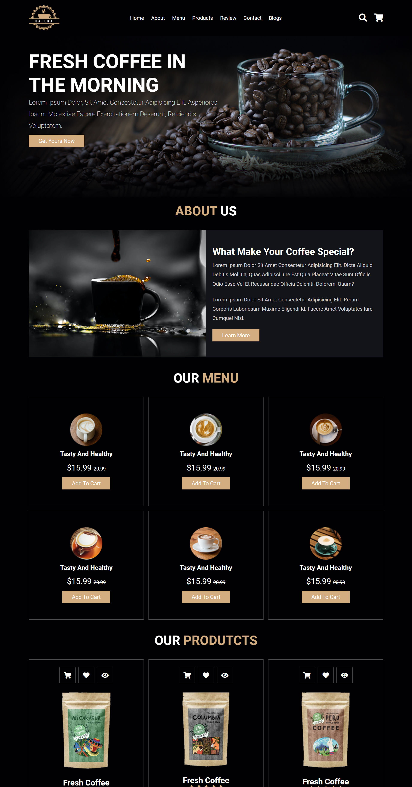

# Coffee Shop Website

## Visão Geral

### Projeto de uma cafeteria online com design moderno e responsivo a todos os tipos de tela.
#



#
## Construido com:
- HTML Semântico
- CSS
  - Design Responsivo
- JavaScript

## Funcionalidades
- Cafeteria online com design moderno e responsivo a todos os tipos de tela.

## O que eu aprendi:
- Manipulação do DOM com:
```js
  document.querySelector('.main-container')
  document.querySelectorAll('.btn')
  document.getElementById('submit')
```
- laços de repetição
```js
  rates.forEach(rate => {})
```
- Eventos
```js
  document.querySelector('#menu-btn').onclick = () => {
  navbar.classList.toggle('active')
  searchForm.classList.remove('active')
  cartItem.classList.remove('active')
}
```
- Boas práticas com JavaScript
#

## Link

Veja o deploy do projeto aqui: [Acessar 🌍](https://devhiderlan.github.io/coffee-shop-website/) 

## Autor

Hiderlan Santana: [Linkedin](https://www.linkedin.com/in/hiderlan-santana/)